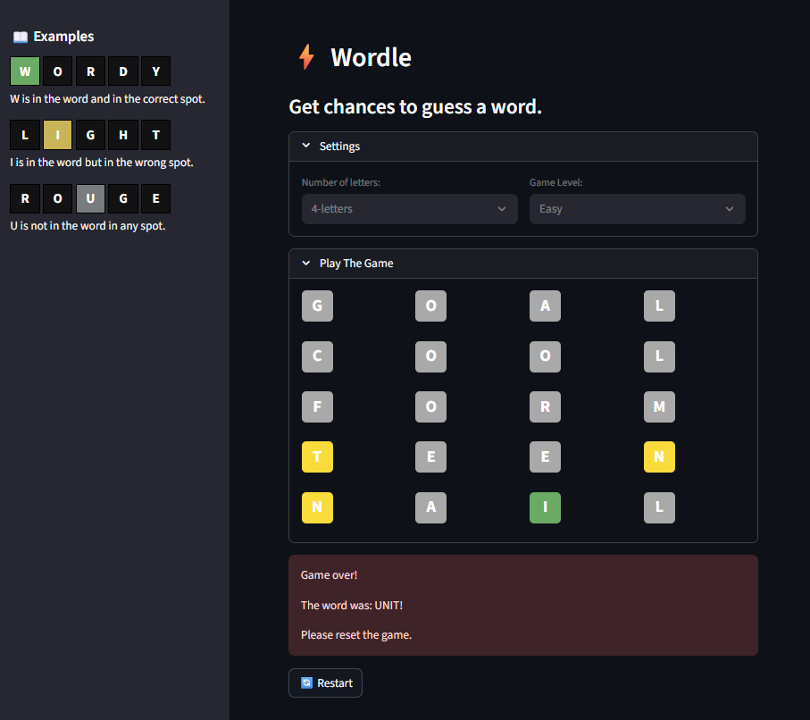

# ⚡ Wordle Clone – Streamlit App

A fully interactive **Wordle-style word guessing game** built with [Streamlit](https://streamlit.io/).  
Players configure the **word length** and **difficulty level**, then attempt to guess the hidden word within a limited number of tries.



---

## ✨ Features
- **Dynamic Game Configuration**
  - Choose word length (4, 5, or 6 letters)
  - Select difficulty level (Easy / Normal / Hard)
- **Color Feedback**
  - 🟢 Green (`#6AAA64`) – correct letter & position  
  - 🟡 Yellow (`#F9DC3C`) – letter exists but wrong position  
  - ⚪ Gray (`#A9A9A9`) – letter not in the word
- **Random Word Selection**
  - Words are chosen from a frequency-based dictionary to ensure fair play
- **Responsive UI**
  - Built entirely with Streamlit (no JavaScript required)
  - Works seamlessly in browser (desktop & mobile)
- **Restart Button**
  - Instantly reset and start a new game without page refresh

---

## 🧩 Dependencies

- ```Streamlit``` - interactive web interface

- Standard Library modules (```random```, ```typing```)

```bash
pip install -r requirements.txt
```
## 🚀 AI Assistant

The current version uses open-source LLM model **Llama3.2** to power the AI assistant in the sidebar.

In order to switch to a different model, simply change the `model` variable in `st_app.py`:

```python
model = "llama3.2"  # Change to your desired model name
```
But, before switching, ensure that the model is compatible with the `call_llama_func` function in `llama_utils.py`.
### Installation of Llama3.2
You can use the following command to install Llama3.2:

1. Go to the [llama GitHub repository](https://github.com/ollama/ollama)
2. Follow the installation instructions provided in the repository to set up Llama3.2 on your local machine.
3. You can install any other model by following the same steps, then customizing the `model` variable in `st_app.py`.
