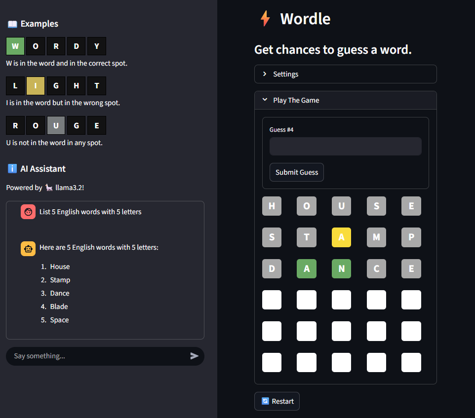

# ⚡ Wordle Clone – Streamlit App

A fully interactive **Wordle-style word guessing game** built with [Streamlit](https://streamlit.io/).  
Players configure the **word length** and **difficulty level**, then attempt to guess the hidden word within a limited number of tries.



---

## ✨ Features
- **Dynamic Game Configuration**
  - Choose word length (4, 5, or 6 letters)
  - Select difficulty level (Easy / Normal / Hard)
- **Color Feedback**
  - 🟢 Green (`#6AAA64`) – correct letter & position  
  - 🟡 Yellow (`#F9DC3C`) – letter exists but wrong position  
  - ⚪ Gray (`#A9A9A9`) – letter not in the word
- **Random Word Selection**
  - Words are chosen from a frequency-based dictionary to ensure fair play
- **Responsive UI**
  - Built entirely with Streamlit (no JavaScript required)
  - Works seamlessly in browser (desktop & mobile)
- **Restart Button**
  - Instantly reset and start a new game without page refresh

---

## 🧩 Dependencies

- ```Streamlit``` - interactive web interface

- Standard Library modules (```random```, ```typing```)

```bash
pip install -r requirements.txt
```
## 🚀 Versions
- [X] Version 1.0:
    - The Simple Wordle Game
- [ ] Version 2.0:
    - It will be featured with AI chatbot to guide the user
